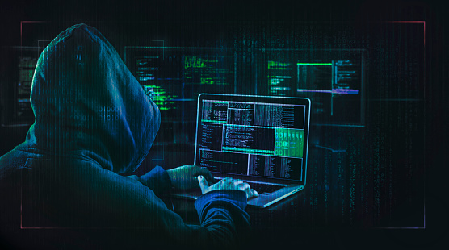

# StegoCloak

<p align="center">
  
</p>

<p align="center">
  <b>Password-keyed steganography + AES-256-GCM authenticated encryption + CNN steganalysis</b>
</p>

<p align="center">
  
  
  
  
  
</p>

---

## What is StegoCloak?

**StegoCloak** hides encrypted secret messages invisibly inside ordinary image files.
To any observer, the image looks completely normal. Only someone with the correct
password can find and decrypt the hidden message.

- **No detectable magic bytes** — unlike most stego tools, StegoCloak writes zero
  plaintext markers into the carrier image. There is nothing to find without the password.
- **Password-derived header position** — even the location of the hidden data is secret.
- **AES-256-GCM** authenticated encryption — military-grade, tamper-evident.
- **scrypt KDF** — password brute-force is computationally expensive.
- **Optional CNN steganalysis** — train a detector to find stego images.
- **Optional LLM transforms** — paraphrase, translate, or professionalize via local Ollama.

---

## Author

**Akila Lourdes Miriyala Francis**
© 2025 — MIT License

---

## Security Model

| Property | Implementation |
|---|---|
| Encryption | AES-256-GCM (authenticated) |
| Key derivation | scrypt (N=2¹⁶, r=8, p=1) — upgradeable per message |
| Stego positions | Password-keyed CSPRNG, no-replacement sampling |
| Header location | Password-derived offset — unknown without key |
| Header contents | XOR-encrypted with scrypt-derived mask |
| Magic bytes | None — zero detectable markers |
| Integrity | GCM authentication tag + CRC-32 |
| Compression | zlib before encryption (leak-safe ordering) |

---

## Install

```bash
git clone https://github.com/yourname/stegocloak
cd stegocloak

python -m venv .venv
source .venv/bin/activate        # Windows: .venv\Scripts\activate

pip install -e .                  # core install
pip install -e ".[dev]"           # + pytest
pip install -e ".[ml]"            # + CNN steganalysis (needs PyTorch)
pip install -e ".[llm]"           # + LLM transforms (needs Ollama)
```

---

## Quick Start

### Interactive Wizard (easiest)

```bash
stegocloak
```

Pick option `1` to hide a message, `2` to retrieve it.

### CLI

**Hide a message:**
```bash
stegocloak encrypt-png \
  --in  photo.png \
  --out stego.png \
  --password "mysecret" \
  --message "Hello, this is hidden"
```

**Retrieve the message:**
```bash
stegocloak decrypt-png \
  --in  stego.png \
  --password "mysecret"
```

**With ECC (robust against minor image corruption):**
```bash
stegocloak encrypt-png --in photo.png --out stego.png \
  --password "pw" --message "text" --ecc 3
```

**With stronger KDF (for high-value payloads, ~1s):**
```bash
stegocloak encrypt-png --in photo.png --out stego.png \
  --password "pw" --message "text" --kdf-profile sensitive
```

---

## CLI Options Explained

### ECC repetition factor (`--ecc`, default `1`)

Each bit of your message is repeated N times for error correction.

| Value | When to use |
|---|---|
| `1` | Normal use — image is clean and untouched |
| `3` | Image may be re-saved or lightly processed |
| `5–9` | Maximum protection — significantly reduces capacity |

### Compression (`--compression`, default `zlib`)

Compresses your message before encryption so it fits in smaller images.
Always use `zlib` unless you have a specific reason not to.

### KDF Profile (`--kdf-profile`, default `interactive`)

Controls how hard your password is to brute-force.

| Profile | Speed | Strength | Use when |
|---|---|---|---|
| `interactive` | ~0.1s | Strong | Everyday use |
| `sensitive` | ~1.0s | 32× stronger | High-value secrets |

### LLM Transforms (`--llm-mode`, requires Ollama)

Runs your message through a local AI before encrypting. **Note: lossy.**

| Mode | What it does |
|---|---|
| `compress` | Shortens while preserving meaning |
| `paraphrase` | Rewrites in different words |
| `professionalize` | Makes it formal and professional |
| `summarize` | Condenses to 1–2 sentences |
| `translate` | Translates to another language |

> ⚠️ When using `translate`: encrypt TO the target language, decrypt back TO your language.
> Example: encrypt → Korean, decrypt → English.

---

## Supported Formats

| Format | Embed | Extract | Notes |
|---|---|---|---|
| `.png` | ✅ | ✅ | Recommended |
| `.bmp` | ✅ | ✅ | Lossless |
| `.tif/.tiff` | ✅ | ✅ | Lossless |
| `.jpg/.jpeg` | ❌ | ❌ | Lossy — destroys hidden bits |
| `.webp` | ❌ | ❌ | Lossy — destroys hidden bits |
| `.gif` | ✅ metadata | ✅ metadata | Comment block only (not covert) |
| `.mp4/.mkv` | ✅ metadata | ✅ metadata | ffmpeg metadata tag (not covert) |

---

## CNN Steganalysis (Optional)

Train a ResNet-18 detector on your own images:

```bash
# Train
python -m stegocloak.ml.train_cnn \
  --covers ./my_images \
  --out    detector.pth \
  --epochs 10

# Evaluate
python -m stegocloak.ml.eval_cnn \
  --covers  ./my_images \
  --weights detector.pth \
  --pr-table

# Detect a single image
stegocloak detect --in suspect.png --weights detector.pth
```

Training features: pretrained ResNet-18 backbone, train/val split, cosine LR scheduler,
early stopping, best-model checkpointing, weighted sampler, ROC-AUC evaluation.

---

## Run Tests

```bash
python -m pytest tests/ -v
# 58 passed
```

Test coverage includes: roundtrips (all ECC levels, all formats, Unicode, empty, large
payloads), wrong password rejection, no plaintext magic bytes, PSNR visual similarity,
LSB-only pixel modification, capacity boundary, legacy format compatibility, tampered
ciphertext, KDF agility, nonce uniqueness, SHA audit chain, GIF roundtrip, and full
end-to-end pipeline tests.

---

## Limitations

- PNG LSB stego is **fragile**: resizing or re-encoding (e.g. saving as JPEG) destroys the hidden data. Always keep a lossless copy.
- GIF and video paths use **metadata embedding** — not covert against an informed adversary with a hex editor.
- CNN detection quality depends on training dataset size and diversity.
- LLM transforms are **lossy** — the AI may slightly rephrase your message.

---

## License

MIT License — Copyright (c) 2025 **Akila Lourdes Miriyala Francis**

See [LICENSE](LICENSE) for full terms.
